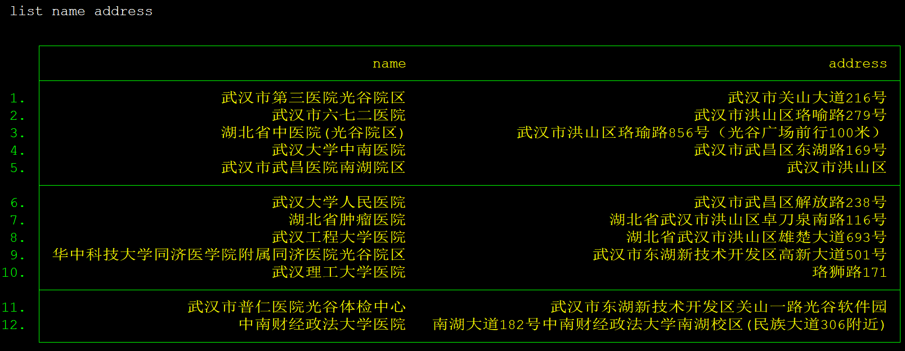

# cnmapsearch
cnmapsearch: 该命令利用百度地图API接口获取指定地点周围特定店家信息

## 声明(statement)

Stata作为全球知名的统计分析软件，其外部命令的主流书写语言为英文。但由于本命令的使用人群主要是中文区用户，因此README也使用中文书写，以提高大家的使用效率，同时sthlp文件为英文版，兼顾其它地区人群使用。

Stata as the world's leading statistical analysis software, the external command of the mainstream writing language is English.However, due to the fact that the users of this program are mainly Chinese users, the README documents are also written in Chinese so as to enhance the efficiency of everyone's use.At the same time sthlp file for the English version, taking into account the use of other regions of the population.

## 概述

cnmapsearch 命令通过调取百度地图API，获取并返回某个地点一定范围内指定关键词地点的信息，cnmapsearch 支持经纬度及中文描述两种方法表示地点，也支持单一地点查询及变量批量查询两种方式。

## 安装

### 百度地图API密钥

若要使用本命令，需要在[百度地图开放平台](http://lbsyun.baidu.com/) 申请地图API密钥，cntraveltime的实现机制也是通过调取API获得其中的信息，并作出相应的处理与加工。在本篇说明中所使用的密钥均经过修改。

### cnmapsearch

在Stata中使用github命令下载，关于如何使用github下载github站点内的命令，可以参见爬虫俱乐部的往期推文 [《SSC的好兄弟“github”》](https://stata-club.github.io/%E6%8E%A8%E6%96%87/SSC%E7%9A%84%E5%A5%BD%E5%85%84%E5%BC%9F%E2%80%9Cgithub%E2%80%9D/)


```
github install stata-club/cnmapsearch
```

## 使用方法示例

如果您对示例中所使用的参数感到疑惑，可在浏览完参数介绍后再看示例

首先我们以地址参数作为变量为例，通过cnmapsearch搜寻一组地址周围的关键词为"食"的地址信息。

```
clear
input str100 address
"湖北省武汉市洪山区中南财经政法大学"
"湖北省武汉市武昌区政府"
"陕西省西安市雁塔区大雁塔"
end
```

可以看到现在地址数据集中有变量 `address` 其中都是以中文描述记录的地址信息


我们使用cnmapsearch搜索这些地点附近关键词为"食"的地址信息。

```
cnmapsearch, baidukey(RkwfPwoNKz7BScyor0nZvW) addr(address) keyword("食") filter(cater-)
```


其次我们可以使用 `singleaddr` 来输入单一地址进行查询

```
cnmapsearch,baidukey(RkwfPn3P5XZoNKz7BScyor0nZvW) singleaddr("湖北省武汉市洪山区中南财经政法大学") keyword("食") filter(cater-price)
```


cnmapsearch 支持经纬度作为地址参数(并且我们推荐大家使用经纬度作为地址参数), 与`address` 和 `singleaddr` 相对应的是 `addr_lat\addr_lng` 和`singlecoord`。

```
cnmapsearch,baidukey(RkwfPn3P5XZoNKz7BScyor0nZvW) singlecoord("30.506959,114.384945") keyword("医院") radius("9000") filter(cater) number("12")

```



## 使用场景

### 应用研究

如果您目前的研究涉及到与特定类别地点有关的数据，如探寻`城市咖啡店与创新创业间的关系`，您则可以使用cnmapsearch迅速查找到相关数据，并作出有效比对。

### 休闲娱乐

cnmapsearch 的一个特点是，其返回值大多不可量化，或量化能力较差，但其确实在生活实用性上颇具优势。

如果您工作累了，就可以顺手在Stata中检索一下自己周围有没有什么好吃的好玩的，并且支持一次性显示多个结果，直观方便，比直接在百度地图中查找要更快捷一些。实乃居家旅行必备之良品。

## 参数介绍

### baidukey(str)

在这个参数下填入你自己的百度地图API密钥，关于如何获取百度地图密钥，[请访问这里](http://lbsyun.baidu.com/apiconsole/key/create) 

在这里需要注意的是，如果您所提供的参数是经纬度的话，cntraveltime会直接进行查询，即仅耗费一次查询，如果您所提供的参数是中文描述，则cntraveltime会额外再查询一次其所在的经纬度，因此如果您需要进行较大规模数据查询，请尽量使用经纬度作为参数以提高搜索效率，节省搜索额度。

### addr_lat(varname) & addr_lng(varname)

地点`经纬度变量`，如果您关于地点的参数为经纬度，请使用该选项。该选项必须两两出现，并且不能与 address(varname) 同时出现。

### addr(varname)

地点`地址变量`，如果您关于地点的参数为中文描述，请使用该选项，并且不能与 `经纬度变量` 同时出现。

### singleaddr(string) & singlecoord(string)

如果您不想批量查找许多地址的周边信息，可以使用`singleaddr` 或者 `singlecoord` 来输入单一的中文描述及坐标参数。需要注意的是，这种情况下与`经纬度变量` 和 `地址变量` 所获得数据的结构是不一样的。

### number(str)

规定命令返回多少个相关信息，范围是1~20，默认值为10，如果找到的信息未能达到指定数目，则返回尽可能多的信息。

### radius(str)

规定命令的搜索范围。百度地图API的检索以指定地点为圆心，一定长度为半径在圆内搜索。该值的默认值为2000米。

### seeradius

显示本次搜索所采用的搜索半径

### filter(str)

该选项可以用来指定本次检索的信息所属的行业类别。并可依据不同标准对结果进行排列。

具体地说，filter可以指定三种行业类别，分别是 cater(餐饮)、life(生活)、hotel(酒店)，百度地图API给所有的店家都赋予了不同行业类别，如果您在搜索中指定了某个类别，则本次搜索所得到的信息均为该类别下的信息，这个选项起到了过滤无用地址的作用，因此取名为filter

而在每一种类别下，filter提供了多种模式对搜索结果进行排列。如在cater类别下，可以使用distance 选项，使搜索结果依照距离圆心远近来排列，离圆心越近者优先排列。又比如在hotel类别下，可以使用level选项，使搜索结果依照宾馆的星级来进行排列，星级越高优先排列。详细参数指标见下方

- cater
    - distance  依照距离圆心远近来排列
    - price     依照消费水平高低来排列
    - ovelall_rating    依照消费者对其评分高低来排列(评分数据取自美团&大众点评)
    - taste_rating      依照口味评分高低来排列(评分数据取自美团&大众点评)
    - service_rating    依照服务质量高低来排列(评分数据取自美团&大众点评)
- life
    - distance  如上
    - price     如上
    - overall_rating    如上
    - comment_num   等同于 service_rating
- hotel
    - distance  如上
    - price     如上
    - total_score   等同于overall_rating
    - level     依照宾馆星级高低进行排列
    - health_score  依据宾馆卫生质量评分进行排列

#### 如何使用该选项？

在cnmapsearch命令后，加入一条filter选项，形如 filter(类别-排序方式)，如filter(hotel-level) 即可。如果类别书写正确而排序方式书写错误，则命令仍会按照正确类别进行检索，而排序方式使用默认排序方式，如果类别书写错误，则命令会忽略掉filter选项。

### seefilter

显示本次搜索所指定的行业类别。

## 作者

Chuntao LI
School of Finance, Zhongnan University of Economics and Law
Wuhan, China
chtl@zuel.edu.cn

Yuan Xue
School of Finance, Zhongnan University of Economics and Law
Wuhan, China
xueyuan19920310@163.com

Xueren Zhang
School of Finance, Zhongnan University of Economics and Law
Wuhan, China
zhijunzhang_hi@163.com